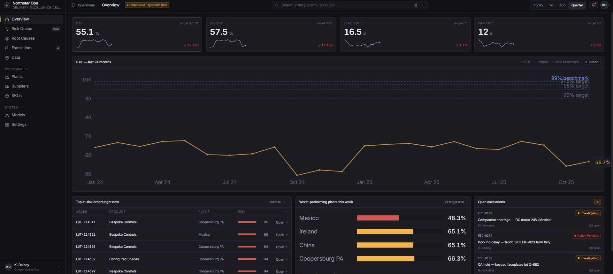
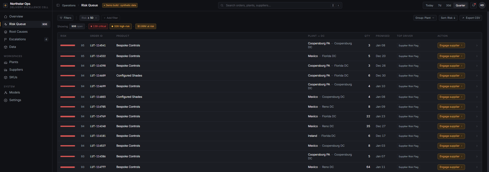
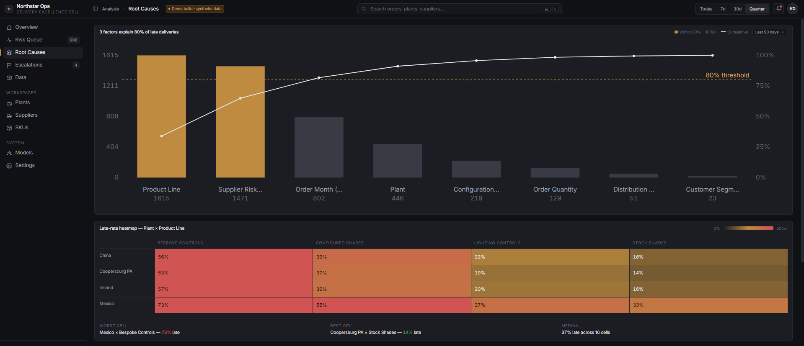
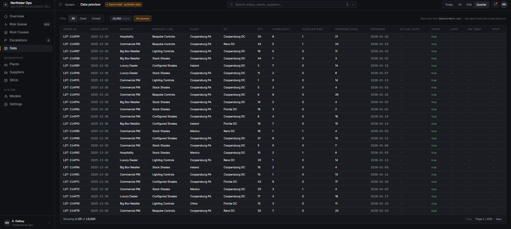

# Delivery Excellence Cell — Year 2 Predictive Analytics Prototype

A working software artifact accompanying the team's Lutron case-report recommendation of **Option 3: Delivery Excellence Cell**. The Cell is proposed as a permanent cross-functional unit whose mandate is to convert delivery escalations into permanent systemic fixes. This prototype implements the **Year 2 deliverable** of that proposal: the predictive analytics layer that the Cell would use day-to-day to surface at-risk orders, attribute root causes, and direct structural-fix priorities.

The point of the artifact is to demonstrate that the Year 2 scope is technically straightforward on commodity tooling, and that the per-order risk score it produces is the direct data input for the Year 3 customer-facing modules (Promise Date, Tiered SLAs).

## Substance

**Dataset.** 15,000 synthetic orders across 24 months, deterministic seed. The generator (`src/data_generator.py`) encodes the patterns identified in the case report's diagnosis: Configured and Bespoke product lines run later than Stock (28% vs. 5% baseline), the Mexico plant has elevated late-rate during its mid-2024 ramp window, supplier risk concentrates in Mexico and Bespoke Controls, Q4 carries a 1.5× seasonality multiplier, and large/complex orders slip more often. The most recent ~8% of orders are flagged open (no realized delivery yet) and serve as the model's prediction targets.

**Model.** A `HistGradientBoostingClassifier` (scikit-learn) trained on closed orders, predicting `is_late` from nine features: customer segment, product line, plant, distribution center, quantity, configuration complexity, supplier risk flag, promised lead days, and order month. 80/20 stratified train/test split. **Held-out test AUC ≈ 0.74** — meaningfully above chance, demonstrating the architecture works on Lutron-shaped data. Global feature ranking is computed via permutation importance and feeds the Pareto chart on the Root Causes screen.

**Per-order attribution.** Each open order receives a top-driver assignment that maps onto a recommended DEC action ("engage supplier," "reroute capacity," "expedite engineering review," etc.). The current implementation is a rule-based heuristic that prioritizes the same factors the model treats as most predictive; production deployment would substitute TreeSHAP for true per-row attribution.

**Architecture.** Two-process application. FastAPI backend (`api/`) wraps the Python data and model layer and exposes a JSON API. Vite + React + Tailwind frontend (`web/`) renders the operator console. Backend bootstrap generates the dataset and trains the model on first launch (~10 seconds), then caches both to disk; subsequent launches are instant.

## Operator console

Four screens, all driven by live API responses against the scored dataset.

### Overview



The executive view. The four KPI tiles (OTIF 55.1%, On-Time 57.5%, Lead Time 16.5d, Variance 12d) read against the case-report's Year 1/2/3 target bands (90/95/97.5%) and the Amazon 99% benchmark on the 24-month OTIF trend. Each tile carries a sparkline of the last 13 months and a delta against the prior equal-length window: the 10.2pp OTIF drop is computed live, not annotated. The right column lists open escalations (currently a static stub corresponding to the Year 1 module), the worst-performing plants this week (Mexico is the visible outlier, matching the case report's diagnosis of ramp variance), and the top open orders by model risk score.

### Risk Queue



The Cell's firefighting console. All 906 open orders are scored 0–100% by the gradient-boosted model. The summary chips (139 critical, 326 high-risk, $3.99M at risk) are computed from the live scored frame. Every row carries the model's top-driver assignment (here: Supplier Risk Flag dominates, consistent with the case report's identification of supplier risk as concentrated in Mexico and Bespoke Controls) and a recommended DEC action. Acting on a row posts to the backend, removes it from the queue, and refreshes the summary chips and the open-count badge in the sidebar — the integration is live, not cosmetic. The visible plant-and-product mix (Coopersburg PA and Mexico Bespoke Controls) reflects the encoded structural pain points.

### Root Causes



The structural-fix prioritization view. The Pareto headline ("3 factors explain 80% of late deliveries") is generated live from the model's permutation-importance ranking; Product Line, Supplier Risk Flag, and Order Month together cross the 80% threshold. The plant × product-line late-rate heatmap calls out Mexico × Bespoke Controls as the worst cell at 73% late, with Coopersburg PA × Stock Shades as the best at 14%. The annotated 16-month OTIF trend marks the Q4 surge inflection points (Oct 2024 and Oct 2025) where the case report locates the seasonality pain. Together these three views answer "where should the Cell's structural-fix backlog point first."

### Data preview



Paginated raw view of the 15,000-row training frame, filterable by open/closed status. The screen is included to make a credibility point: the dashboard reads from the same 16-column data frame the model is trained on. Order IDs, dates, segments, plant assignments, configuration complexity, supplier risk flags, and outcome columns are all visible. The "Demo build · synthetic data" badge in the top bar is intentional; when this Cell is operational, this preview becomes the live OMS connector view from the Year 1 deliverable.

## How to run it

Two processes, from `delivery-excellence-cell/`:

```bash
# Backend
pip install -r requirements.txt
python -m uvicorn api.main:app --reload --port 8000

# Frontend (separate shell)
cd web
npm install
npm run dev    # http://localhost:5173
```

`POST /api/regenerate` rebuilds the dataset and retrains the model end-to-end; useful for demonstrating that the pipeline is live rather than scripted.

## Project layout

```
delivery-excellence-cell/
├── api/                      FastAPI surface (main.py, shaping.py)
├── src/                      Domain modules
│   ├── data_generator.py     Synthetic Lutron orders (deterministic seed)
│   ├── risk_model.py         Gradient-boosted classifier + scoring
│   ├── kpis.py               OTIF / Fill Rate / Lead Time calculators
│   └── benchmarks.py         Amazon / industry-best constants
├── web/                      Vite + React + Tailwind frontend
├── data/                     Generated on first API boot (gitignored)
├── legacy_streamlit/         Earlier Streamlit MVP, retained as fallback
└── requirements.txt
```

## Mapping to the case-report roadmap

- **Year 1 (data foundation).** The Overview screen is the executive view of what the Cell would own once it has live OMS/ERP data. The synthetic generator is the placeholder for that integration.
- **Year 2 (predictive analytics).** Implemented here. The Risk Queue and Root Causes screens are the Cell's working surfaces; the gradient-boosted model and per-order attribution are the analytical core.
- **Year 3 (customer-facing modules).** The per-order risk score produced here is the direct data input required by the Promise Date and Tiered SLA modules proposed as later phases. Building it now is what makes the staged sequencing argument operationally credible.

## Deliberately out of scope

- ERP / OMS integration. The Year 1 deliverable; not built here. The synthetic generator is its placeholder.
- Per-row TreeSHAP attribution. Rule-based heuristic substitutes; a ten-line swap.
- The Cell's escalation log / systemic-fix tracker (Year 1 module). The Overview shows a static stub.
- Promise-Date and Tiered-SLA modules. Year 3.
- Authentication, role-based views, and multi-user state.
